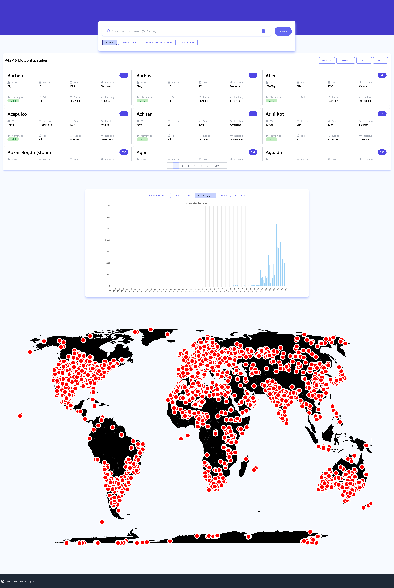

# Fireball Meteorite Strikes - web app

Fireball Meteorite Strikes - web app is to access and see the Meteorite data from the NASA database.

## Table of Contents

- [Project Description](#project-description)
- [Major Functions and Features](#major-functions-and-features)
- [Dependencies](#dependencies)
- [Project setup](#project-setup)
- [Usage](#usage)
- [Deployment](#deployment)

## Project Description

Fireball Meteorite Strikes - web app is to access and see the Meteorite data from the NASA database. By default user can see the entire data on the page. User can also search meteorite by its name, year of strike, composition (recclass) and mass. Moreover, the User can see the result on the graphics sorted by name, year, composition and mass and also see the result on the map (marked location).

## Major Functions and Features

1. **List of meteorite data displayed in cards:** Entire meteorite data from the database is displayed on this data list as a card with pagination option by default. Additionally user can sort the meteorite data by its name, year, composition and mass. Updated search results are shown on this card, when user do the search on search bar.

2. **Graph:** By default the user can see the entire data on the graph. Here the user have an option to interact on the graph and see the "Number of Strikes" and "Average mass" of the default result or searched result of data calculated value as text. And to see the graphical output of the following two options "Strikes by year", "Strikes by composition".  

3. **Map:** By default the user can see the entire data on the map (location marked in red circle). The map result gets updated when the user use the search bar.

---

## Dependencies

To run "Fireball Meteorite Strikes-web app," you will need the following dependencies and libraries:

- axios - Version 1.5.0
- chart.js - Version 4.3.3
- prop-types - Version 15.8.1
- react - Version 18.2.0
- react-chartjs-2 - Version 5.2.0
- react-dom - Version 18.2.0
- react-icons - Version 4.10.1
- react-loading-skeleton - Version 3.3.1
- react-router-dom - Version 6.15.0
- react-simple-maps - Version 3.3.1
- react-loading-skeleton - Version 3.0.0
- react-simple-maps - Version 3.0.0
- react-tooltip - Version 5.21.3
- react-tsparticles - Version 2.12.2
- tsparticles - Version 2.12.2

## Project setup

```
npm install
```

### Compiles and hot-reloads for development

```
npm run dev
```

### Compiles and minifies for production

```
npm run build
```

## Usage

Follow the steps below to effectively use "Fireball Meteorite Strikes-web app" and accomplish tasks in the app:

1. **Installation:**

   Before getting started, ensure you have Node.js and npm (Node Package Manager) installed on your system.

   ```
   npm install
   ```

2. **Running the App:**

   To run the app locally in development mode, use the following command:

   ```
   npm run dev
   ```

   This will start a development server, and you can access the app by visiting the specified URL in your web browser.

## Deployment

- Preview link
https://fireball-meteorite-strikes-app.netlify.app/

- Screenshot of the project

